<html lang="en">

<head>
    <meta charset="UTF-8">
    <meta name="viewport" content="width=device-width, initial-scale=1.0">
    <meta name="description" content="Official website of Getachew Ambaye, a researcher in Engineering. Explore my teaching experience, publications, and contact information.">
    <meta name="keywords" content="Getachew Ambaye, Engineering, Teaching, Research, Publications">
    <title>Getachew Ambaye - PhD Candidate and Researcher</title>
    
    

    
    

        

    
</head>

<body>

    

        
        <nav>
            <ul>
                
                <li><a href="#about">About</a></li>
                <li><a href="#education-experience">Education</a></li>
                <li><a href="#teaching-experience">Teaching Experience</a></li>
                <li><a href="#company-community-service-projects">Projects & Community Service</a></li>
                <li><a href="#publications">Publications</a></li>
                <li><a href="#contact">Contact</a></li>
            </ul>
        </nav>
    

    <section id="home">
        <h1>Welcome</h1>
        
This is the official website of Getachew Ambaye,  a PhD candidate and Reserecher in Industrial Systems and Manufacturing Engineering. Feel free to explore my work and connect with me.

        

            <a href="Resume.pdf" target="_blank">Download Resume</a> | 
            <a href="CV.pdf" target="_blank">Download CV</a>
        

    </section>

    <section id="about">
        <h1>About Me</h1>
        
I am Getachew Ambaye, a PhD candidate in Industrial and Manufacturing Engineering at Wichita State University, with a Master’s and Bachelor’s degree from Jimma Institute of Technology. I currently work as a Direct Graduate Teaching Assistant and an Engineering Professor at Hesston College, focusing on machine design and engineering graphics. My research interests include soft robotics and machine learning applications, resulting in multiple publications. I have led various industry projects, such as designing equipment for the Amhara Dairy Platform and conducting frequency analysis for milling machines. I am open to collaboration opportunities and positions in academia and industry to drive innovation in engineering.

    </section>

    <section id="education-experience">
        <h1>Education</h1>
        <ul>
            <li>PhD in Industrial Systems and Manufacturing Engineering, Wichita State University (2024-)</li>
            <li>MSc in Mechanical Design Engineering, Jimma University (2020)</li>
            <li>BSc in Mechanical Engineering, Jimma University (2016)</li>
        </ul>
    </section>

    <section id="teaching-experience">
        <h1>Teaching Experience</h1>
        <ul>
            <li>
                <strong>Wichita State University (WSU)</strong> - Direct Graduate Teaching Assistant (2022-)
            </li>
            <li>
                <strong>Hesston College</strong> - Engineering Professor (2024-)
            </li>
            <li>
                <strong>Bahir Dar Institute of Technology (BiT)</strong> - Lecturer (2020-2022)
            </li>
            <li>
                <strong>Jimma Institute of Technology (JiT)</strong> - Lecturer (2016-2020)
            </li>
        </ul>

        
Read More

        

            
<strong>2022–Present Direct Graduate Teaching Assistance (GTA) and GRA, WSU, Wichita, KS, USA</strong>

            <ul>
                <li>IME 222, Engineering Graphics (3 Semesters, Summer 2023, Fall 2023, Spring 2024)</li>
                <li>IME 222L, Engineering Graphics Lab (3DX & CATIA V5) (for 2 semesters, Spring 2023, Fall 2024)</li>
                <li>IME 425, Kinematics and Dynamics Design (as GTA), (1 Semester, Fall 2022)</li>
            </ul>
            
<strong>2024–Present Engineering Professor, Hesston College, Hesston, KS, USA</strong>

            <ul>
                <li>ENGR 422, Design of Machines (1 Semester, Fall 2024)</li>
                <li>ENGR 477, Senior Design Capstone Project I (1 Semester, Fall 2024)</li>
                <li>ENGR 372, Mechatronic System Design</li>
                <li>ENGR 371, Fundamentals of Mechatronics</li>
                <li>ENGR 478, Senior Design Capstone Project II</li>
            </ul>
            
<strong>2021–2022 Guest Lecturer/Trainer, Ethio Engineering Group (EEG), Addis Ababa, Ethiopia</strong>

            <ul>
                <li>Product Design and Development: Module 1</li>
                <li>Stress Analysis and Product Modelling: Module 2</li>
            </ul>
            
<strong>2020–2022 Lecturer, Bahir Dar Institute of Technology (BiT), Bahir Dar, Ethiopia</strong>

            <ul>
                <li>Material Handling Equipment Design (3 Semesters)</li>
                <li>Strength of Materials I (1 Semester)</li>
                <li>Strength of Materials II (1 Semester)</li>
                <li>AutoCAD (2 Semesters)</li>
                <li>Engineering Drawing (1 Semester)</li>
            </ul>
            
<strong>2016-2020 Assistant Lecturer - Lecturer, Jimma Institute of Technology (JiT), Jimma, Ethiopia</strong>

            <ul>
                <li>Mechanism of Machinery (1 Semester)</li>
                <li>Design of Machine Elements (1 Semester)</li>
                <li>Maintenance of Machinery (1 Semester)</li>
                <li>Material Handling Equipment (1 Semester)</li>
                <li>Strength of Materials II (2 Semesters)</li>
                <li>AutoCAD (2 Semesters)</li>
                <li>Dynamics (1 Semester)</li>
            </ul>
        

    </section>

    

    
       <section id="company-community-service-projects">
        <h1>Professional Experience and Projects</h1>
        <ul>
            <li> <strong>Industry 4.0 Lab, WSU, Wichita, KS (2022-present)</strong></li>
            
<em>Graduate Research Assistant </em>

            <ul>
                <li> Predicting the Working Space of a Pneumatic Soft Actuator Using Deep Learning.</li>

            <li> 
                Soft Robot Design, Manufacturing, and Operation Challenges: A Review
                
Read More

                

                <!-- Content Row with Image and Text -->
                    

                        

                            Key technical challenges in soft robotics.
                        

                        

                            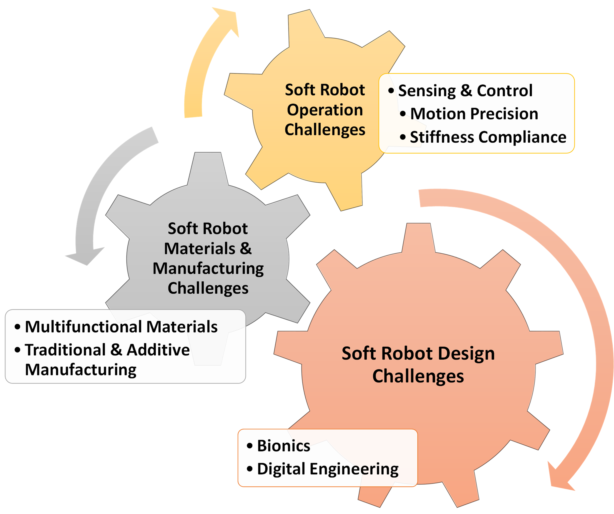
                        

                    

                    

                        

                            The figure below presents FEA simulation models of a pneumatic soft actuator design that is inspired by an elephant trunk.
                        

                        

                            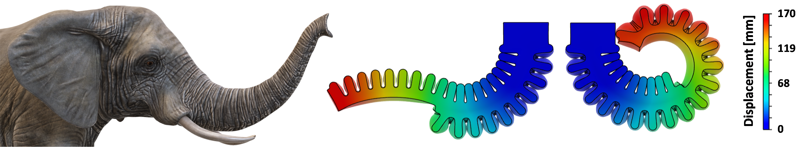
                        

                    

                    

                        

                            The pie chart of soft material usages documented in the selected literature. These materials are mostly used as structural elements, but soft materials with electromagnetic properties may also facilitate sensing and control.
                        

                        

                            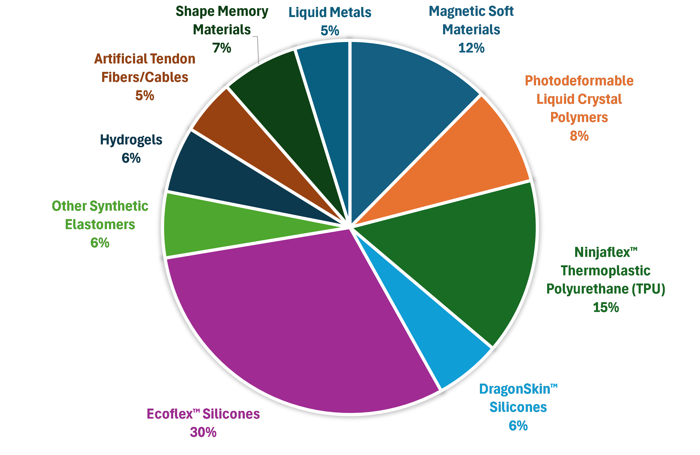
                        

                    

                    

                        

                            The figure below shows an illustration of multi-material 3D printing that uses restricting and actuating materials along with certain design parameter settings, such as A, B, C, D, and E, to fabricate bio-inspired flexible parts with self-shaping properties.
                        

                        

                            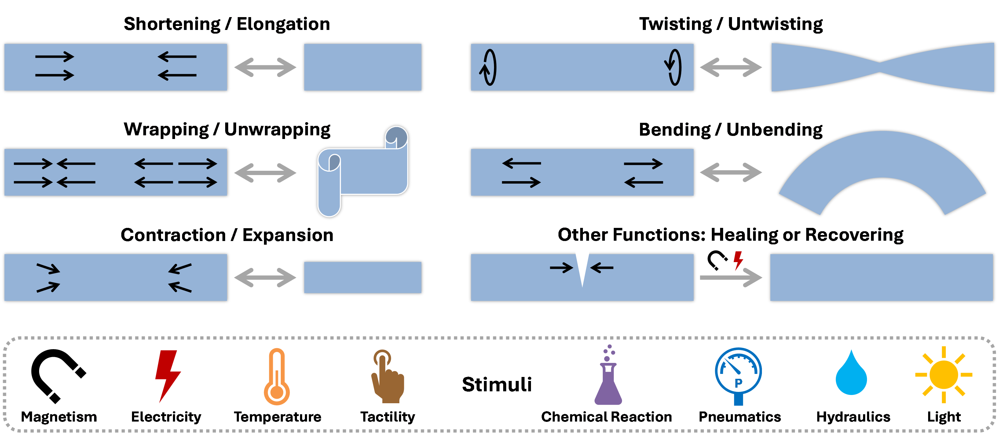
                        

                    

                    

                        

                            The figure below presents the illustrations of common soft actuator functions and their stimuli.
                        

                        

                            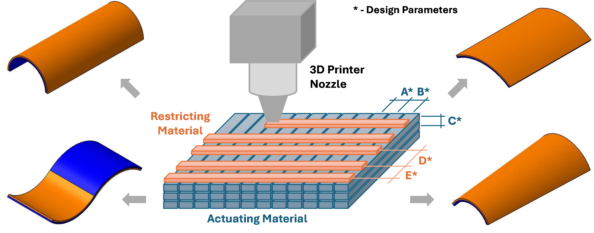
                        

                    

                    

                        

                            The figure below presents the movements of a soft actuator with two asymmetric pneumatic chambers. The soft actuator design, left, is inspired by an elephant trunk. The end trajectories of soft actuator movements are illustrated in a reference frame, right. The bending movements are planar.
                        

                        

                            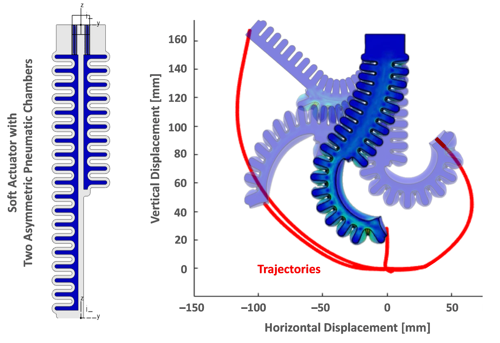
                        

                    

                

            </li>

            <li> Detecting Misalignments of Drilled Holes Using Machine Vision.</li>
            
            <li> Robot Arm Damage Detection Using Vibration Data and Deep Learning.</li>
            
Read More

                

                <!-- Content Row with Image and Text -->
                    

                        

                            
                        

                        

                            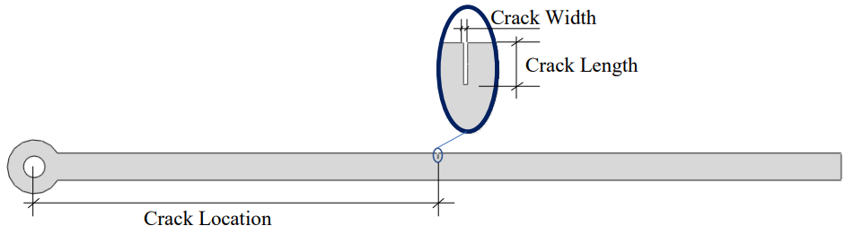
                        

                    

                        

                        

                            
                        

                        

                            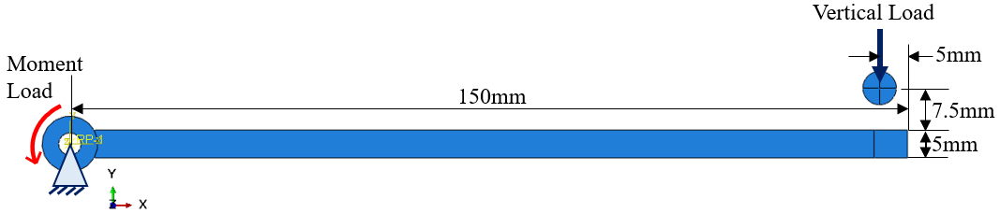
                        

                    

                    
                        

                        

                            
                        

                        

                            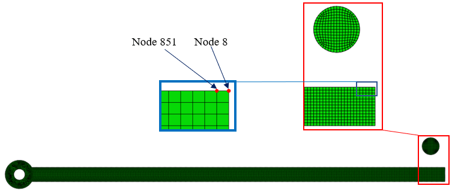
                        

                    

                            

                        

                            
                        

                        

                            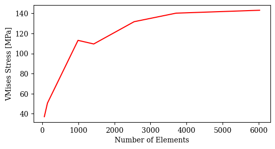
                        

                    

                            

                        

                            
                        

                        

                            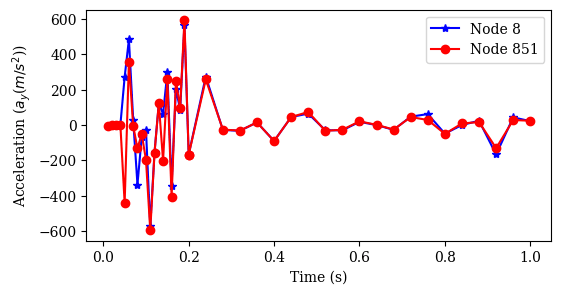
                        

                    

                            

                        

                            
                        

                        

                            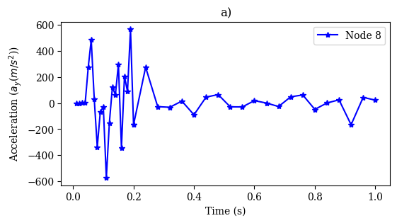
                            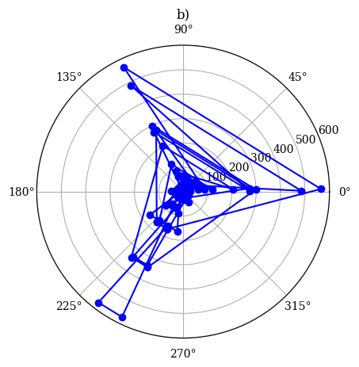
                            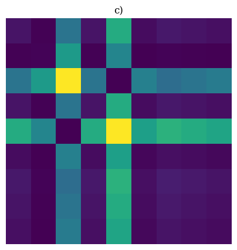
                        

                    

                     
                            

                        

                            
                        

                        

                            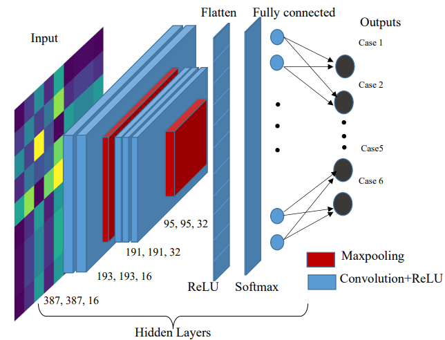
                        

                    

                   
                            

                        

                            
                        

                        

                            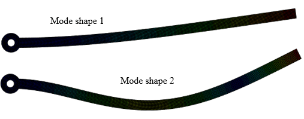
                            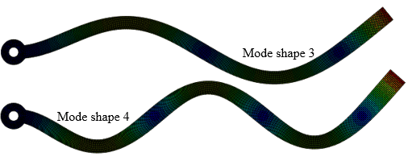
                            
                        

                    

                        

                        

                            
                        

                        

                            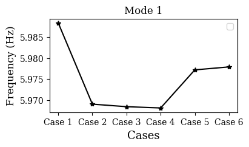
                            
                            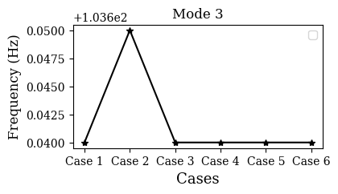
                            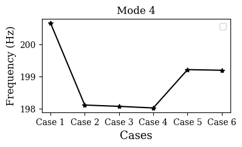
                            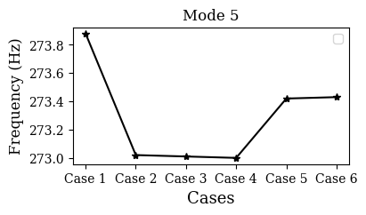
                            
                        

                    

                        

                        

                            
                        

                        

                            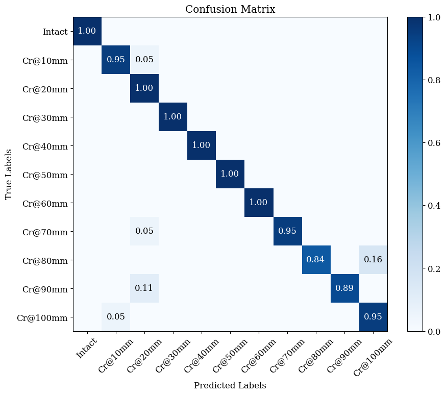
                        

                    

                        

                        

                            
                        

                        

                            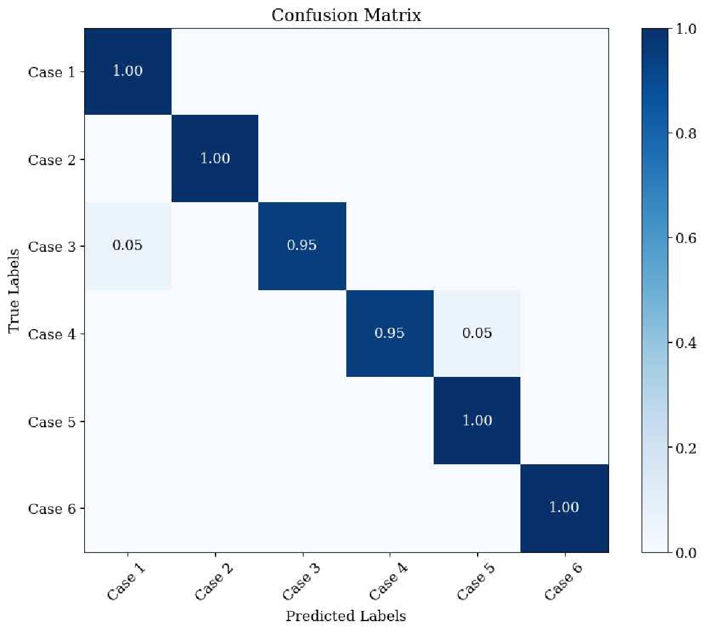
                        

                    

                    
</li>

                    
                    
            <li> Detection of Small Screws Using Machine Learning.</li>
        </ul>

        <li> <strong>Wichita State University, Wichita, KS (2022–Present) </strong></li>
        
<em>Engineering Graphics Instructor</em>

        <ul>
            <li> IME 222L (Engineering Graphics lab) using CATIAV5 and 3DX software.</li>
            <li> IME 222(Engineering Graphics lecture) principles of drawings and GD&T</li>
        </ul>

        <li> <strong>Hesston College, Hesston, KS (2024–Present)</strong></li>
        
<em>Engineering Professor</em>

        <ul>
            <li> Design of Machines (ENGR 422) and Senior Design Capstone Project (ENGR 477), Fundamentals of mechatronics, and Mechatronics system design.</li>
        </ul>

        <li> <strong>Advanced Manufacturing Processes Lab, Wichita, KS (2022-2023, 5 months)</strong></li>
        
<em>Mechanical Design of Machine Tools</em>

        <ul>
            <li> 3-axis milling machine stiffness improvement </li> 
            <li> Finite element (FE) stress & deformation analysis using 3DX SIMULIA </li>
            <li> Natural and forced frequencies for different mode-shapes using 3DX SIMULIA </li>
        </ul>

         <!-- Button to trigger the toggle -->
        <button class="toggle-btn" onclick="togglePDF()">Read More</button>

        <!-- Hidden PDF container that will be toggled -->
        

            <iframe src="3XM/Project_1.pdf" alt="PDF File"></iframe>
            <iframe src="3XM/Project_2.pdf" alt="PDF File"></iframe>
            <iframe src="3XM/Project_3.pdf" alt="PDF File"></iframe>
        

                    

        <li><strong>Ethio Engineering Group, Ethiopia (2020–2022, 6 months) </strong></li>
        
<em>Engineering Product design, and analysis Trainer</em>

        <ul>
            <li> Bench grinding machine design and analysis </li> 
            <li> Delivered specialized training modules on product design and stress analysis.</li> 
        </ul>
        
Read More

                

                  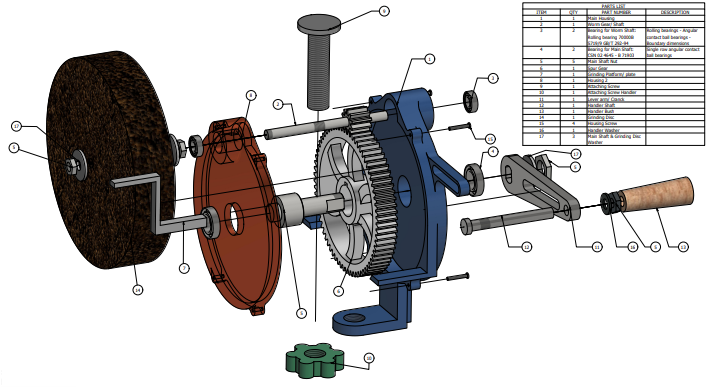
                    <!-- Content Row with Image and Text -->
                    
                    

                        

                            Static analysis of manual bench gridning machine transmission components
                        

                        

                            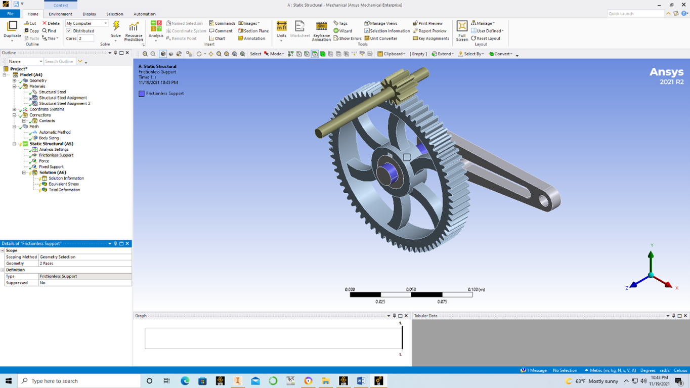
                            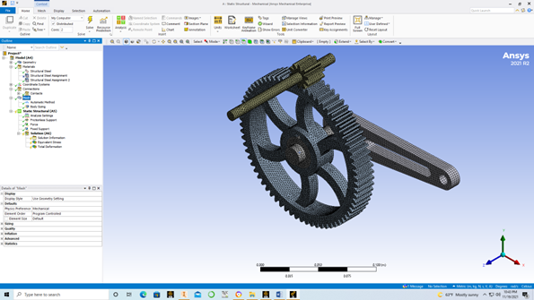
                            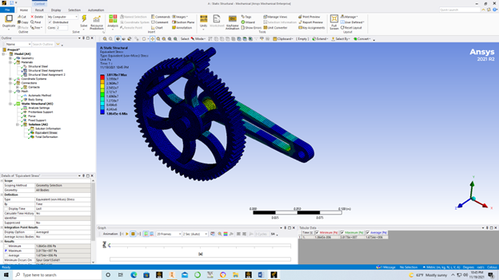
                            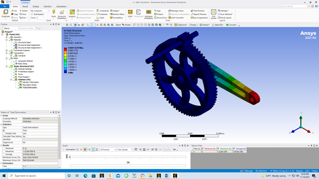
                        

                    

                     

                        

                            Dynamic analysis of manual bench griding machine transmission components
                        

                        

                            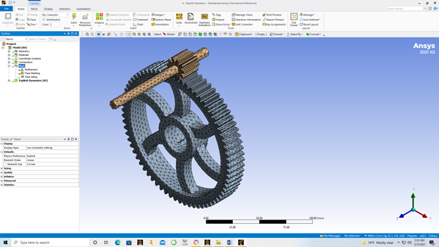
                            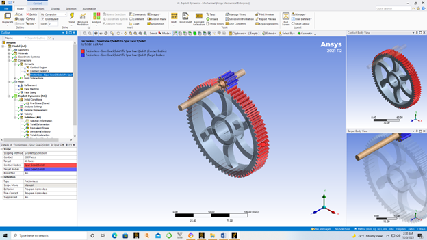
                            
                            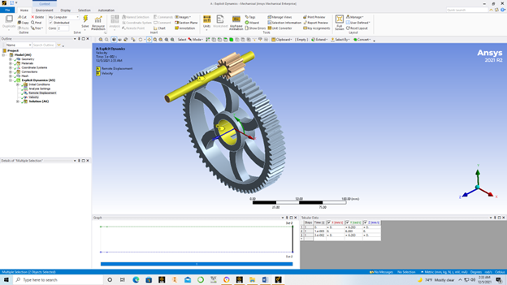
                            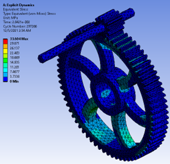
                            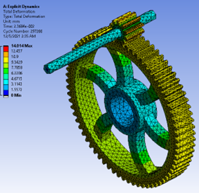
                            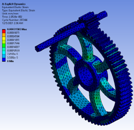
                            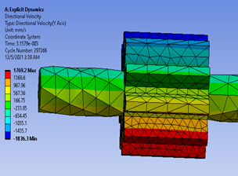
                        

                    

                           

                        

                            Basics of Manufacturing Process Modelling and Simulation: 1.	Sheet Metal Forming Modeling
                        

                        

                            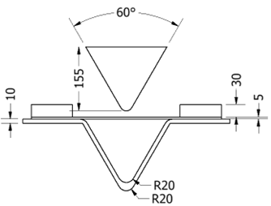
                            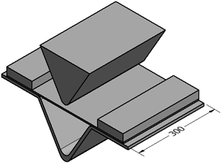
                            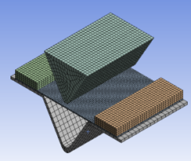
                            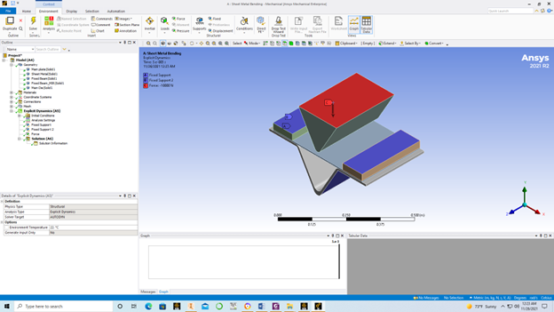
                            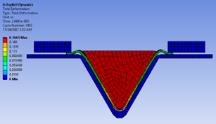
                            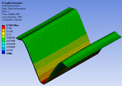
                            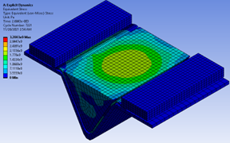
                            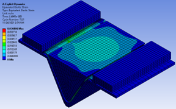
                        

                    

                           

                        

                            Basics of Manufacturing Process Modelling and Simulation: 2.	Extrusion Modeling
                        

                        

                            
                            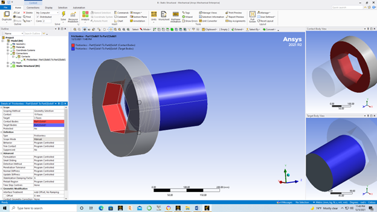
                            
                            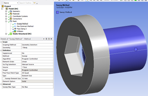
                            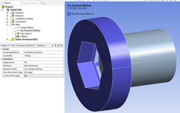
                            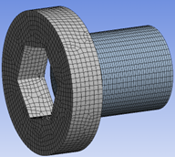
                            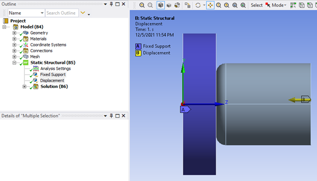
                            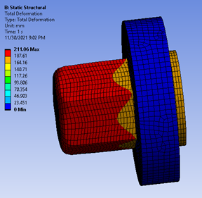
                            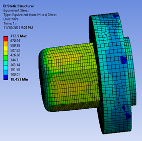
                            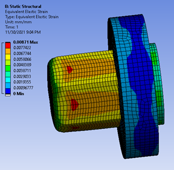
                        

                    

                           

                        

                            Basics of Manufacturing Process Modelling and Simulation: 3.	Deep Drawing Modeling
                        

                        

                            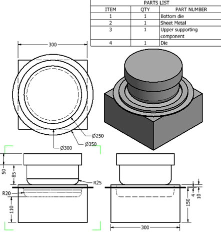
                            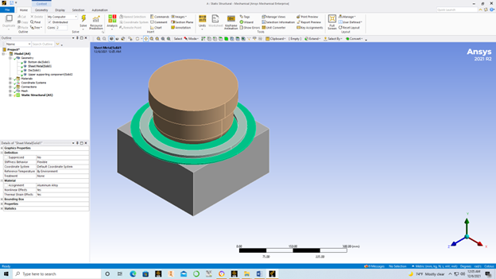
                            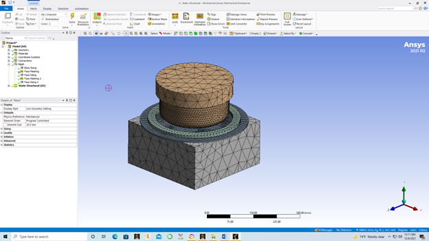
                            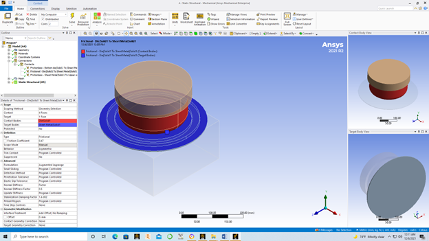
                            
                            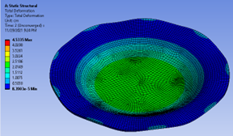
                            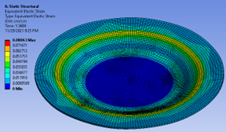
                            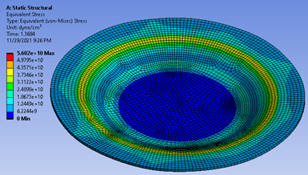
                          

                    

                        

                        

                            Basics of Manufacturing Process Modelling and Simulation: 4.	Rolling Modeling
                        

                        

                            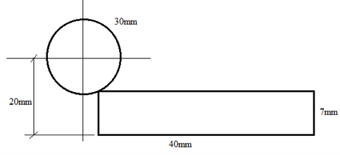
                            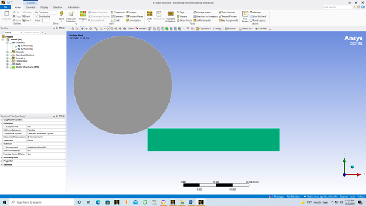
                            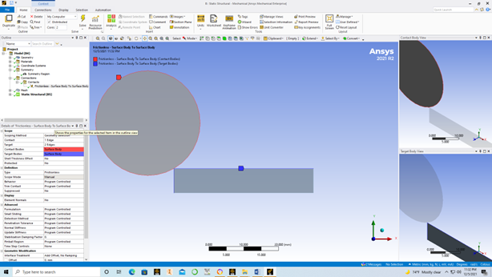
                            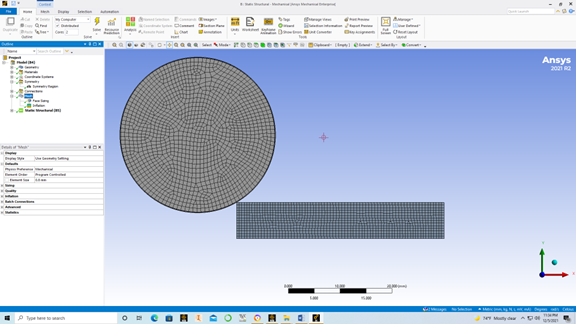
                            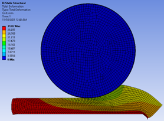
                            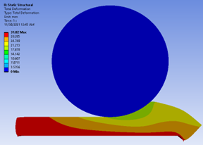
                            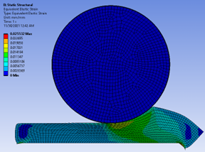
                            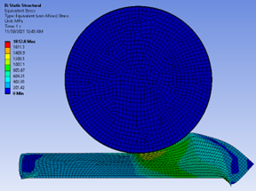
                            

                    
           
                    
                    

        <li><strong>Potato Processing Plant Facility Planning & Design, BiT, Ethiopia (2021-2022)</strong></li>
        
<em>Plant layout designer</em>

        <ul>
            <li> Potato processing plant layout design using Autodesk Inventor software.</li> 
        </ul>

        <li><strong>Amhara Pipe Factory, Ethiopia (2020-2021)</strong></li>
        
<em>Machine designer</em>

        <ul>
            <li> Design of HDPE and PVC pipe pulling machine</li> 
            <li> Performed analysis to determine the load required to pull pipes from the extrusion process to the final cutter machine, taking into account the load imposed by vacuum tank seals.</li> 
        </ul>

        <li><strong>Micro-Dairy Equipment Design for the Amhara Dairy Platform, Ethiopia (2020-2021, 6 months)</strong></li>
        
<em>Machine designer</em>

        <ul>
            <li> Designed processing equipment to enhance local dairy production.</li> 
        </ul>

        <li><strong>Textile industry (internship) 2015-2016</strong></li>
        <ul>
            <li> Design of machine components</li>
        </ul>
    </ul>
    </section>

    
     <section id="publications">
        <h1>Publications</h1>
        <ul>
            <li>
                <strong style="font-size: 1.1em;">Soft Robot Design, Manufacturing, and Operation Challenges: A Review.</strong>
                <i>J. Manuf. Mater. Process.</i> 8(2), 79, 2024. 
                <a href="https://doi.org/10.3390/jmmp8020079" target="_blank">DOI</a>
                
Read More

                

                    
<em>Advancements in smart manufacturing have embraced the adoption of soft robots for improved productivity, flexibility, and automation as well as safety in smart factories. Hence, soft robotics is seeing a significant surge in popularity by garnering considerable attention from researchers and practitioners. Bionic soft robots, which are composed of compliant materials like silicones, offer compelling solutions to manipulating delicate objects, operating in unstructured environments, and facilitating safe human–robot interactions. However, despite their numerous advantages, there are some fundamental challenges to overcome, which particularly concern motion precision and stiffness compliance in performing physical tasks that involve external forces. In this regard, enhancing the operation performance of soft robots necessitates intricate, complex structural designs, compliant multifunctional materials, and proper manufacturing methods. The objective of this literature review is to chronicle a comprehensive overview of soft robot design, manufacturing, and operation challenges in conjunction with recent advancements and future research directions for addressing these technical challenges.</em>

                

            </li>
            <li>
                <strong style="font-size: 1.1em;">Robot arm damage detection using vibration data and deep learning.</strong>
                <i>Neural Comput & Applic.</i> 36 (pp. 1727-1739) 2024. 
                <a href="https://doi.org/10.1007/s00521-023-09150-3" target="_blank">DOI</a>
                
Read More

                

                    
<em>During robot operation, robot components like links and joints may experience collisions or excess loads that can lead to structural damages or cracks. A crack in a structural component can degrade the overall performance of the structure. This study examines the influence of cracks on the vibration characteristics of a baseline robot link. The approach uses the finite element method to simulate the dynamics of planar robot link models with and without artificial cracks with different sizes, locations, and orientations in the ABAQUS software. The robot link models include one intact model and five defective models with cracks. A rectangular crack with a fixed length of 1 mm and a varying width from 0.001 to 0.1 mm is applied to a specific location along the robot link. Finite element analysis and machine learning are used to simulate and characterize the vibration of each robot link with one fixed end and one free end. The vibration responses are measured at the free end. The measured vibration data are then transformed into two-dimensional (2D) image data using the Gramian Angular Summation Field method. A convolutional neural network is then trained with the image data for crack detection and analysis. The results indicate that the proposed method demonstrates 98.25% accuracy on the data generated by the simulation experiments.</em>

                

            </li>

    <li>
    <strong style="font-size: 1.1em;">Detection of Small Screws Using Machine Learning.</strong> 
    <i>2023 International Conference on Information and Communication Technology for Development for Africa (ICT4DA)</i> (pp. 13-18). IEEE. 
    <a href="https://doi.org/10.1109/ICT4DA59526.2023.10302258" target="_blank">DOI</a> 
     
Read More

                

            
 <em> Small screws are commonly employed in assenrbling similar or dissimilar components of various industrial or consumer products. In automated assembly lines, detecting and sorting small targets like screws require accurate sensing and machine learning. Identifying the size of the screw is crucial for assembling and disassembling. This study focuses on the detection of small screws captured in images using a recent machine learning platform named You Only Look Once (YOLO) Version 8. This algorithmic platform offers powerful supervised machine-learning engines with highly competitive accuracy and speed. The data set from this study consists of images of small black carbon steel flat head screws. The dataset is divided into training, development, and testing subsets. There are 24 classes of screws with extremely small difference in attributes in their sizes. The dataset is annotated using the Make Sense open-source annotating tool. The results indicate that the machine learning method demonstrates 99.3% mean average precision (mAP). This detection performance is promising in comparison to the results documented by previous studies.</em>
 
        
 </li>
             
    
             
        <li>
            <strong style="font-size: 1.1em;">Contact temperature analysis of the classical Geneva mechanism through numerical methods.</strong> 
            <i>Materials Today: Proceedings</i>, 57, pp. 545-552. 
            <a href="https://doi.org/10.1016/j.matpr.2022.01.420" target="_blank">DOI</a> 
                 
Read More

                

            
 <em> In this study, the flash temperature of the classical Geneva mechanism has been studied using the numerical method. An excessive sliding motion between the wheel and pin leads to the generation of heat at the contact surfaces, which raises the surface temperature of the two contacting bodies. The flash temperature has been anticipated for different loading cases and coefficients of friction. The analytical Blok equation results are compared with the finite element results, and the results are satisfactory for maximum temperature. Based on the simulation results, the maximum contact temperature occurred in the driving crankpin within 10-15° and 70–75° of the angular position, and as the load increased the contact temperature also increases. In addition, the angular velocity increment produced higher temperatures than the torque load increments.</em>

        
 </li>

              
            <li>
             <strong style="font-size: 1.1em;">Numerical Stress Analysis and Fatigue Life Prediction of the Classical External Geneva Mechanism.</strong> 
             <i>International Workshop of Advanced Manufacturing and Automation (pp. 176-186).</i> Singapore: Springer Singapore. 
             <a href="https://doi.org/10.1007/978-981-19-0572-8_23" target="_blank">DOI</a>
              
Read More

                

            
 <em>  This study examined the stress distribution and predicting the fatigue life of the classical external Geneva mechanism using analytical and finite element methods for three loading cases. The life cycles were analyzed using FE SAFE software by using the stress output database of ABAQUS software, which has been used for stress analysis of the Geneva wheel mechanism. The maximum stress is found at 45∘ of the angular position of the driving crank located at the bottom part of the end of the wheel slot and pin. Doubling the angular speed of the driving crank and doubling the torque that applied on the wheel yields almost equal contact pressure and von Mises stress. The wheel has a lower fatigue life cycle compared to the pin. </em>
 
        
</li>

    
            
            <li>
            <strong style="font-size: 1.1em;">The performance of gear with backlash: A review.</strong>  
            <i>Journal of Applied Mechanical Engineering</i>, 10(9), p. 389.
              
Read More

                

            
 <em>  As the service time of the gear increases, its tooth profile could be deviated from its initial design shape and size as a result of time-varying load, overheating, wear, friction, and other working environmental impacts. Gear backlash is one of the non-linear parameters of the gear that adversely affects the performance of the transmission system. Backlash can be introduced deliberately for lubrication and free paly purposes or due to the gear tooth wear (reduction of the gear tooth thickness). The objective of this paper is to review and encapsulate this literature to provide a wide and good reference for scholars to be utilized. Assessing the effect of backlash on the dynamics and flash temperature of the gear is the main target of this review paper.</em>
 
        
</li>

            
            <li>
            <strong style="font-size: 1.1em;">Numerical comparative modal analysis of connecting rod between fixed crankpin and fixed piston pin.</strong>  
            <i>The 8th International Conference on Innovation in Science and Technology</i>, July 23–25, 2021, in Stockholm, Sweden.
             
Read More

                            

                        
 <em> Connecting rods are subjected to a tensile (inertial force), compressive (gas pressure), and bending (eccentricity) loadings. The boundary conditions used for the determination of its natural frequency depends on the loading type. For free vibration analysis, when the piston moves upward the crankpin needs to be fixed and free piston pin, while when it moves down the piston pin should be considered as a fixed and free crankpin. This paper presents a numerical (ABAQUS software) comparison of the first six dominant mode shapes and natural frequencies of the connecting rod when it is fixed at the crankpin and free at the piston pin (case 1) and fixed at the piston pin and free at the crankpin (case 2) of an optimized geometry that found from literature. The mode shapes and natural frequencies of the two cases are compared, and it shows that the natural frequency of case 2 is lower than case 1. Therefore, for design purpose, the loading frequency should be less than the natural frequency of the connecting rod when it is fixed at the piston pin.</em>
 
                    
</li>

            
            <li>
            <strong style="font-size: 1.1em;">Determination of Important Contact Parameters for Spur Gear Design.</strong>   
            <i>TechHub Journal</i>, 1(1), pp. 28-38.
             
Read More

                            

                        
 <em> This study focused on the determination of the important contact pa-rameters of spur gear design for the investigation of different parametric studies such as the maximum pressure, contact width, contact film thickness, sliding velocities, and others. The single and double tooth contact region has been de-termined for the given gear parameters along with their contact lengths. The contact width and pressure can be determined by considering the engaged spur tooth as a cylindrical object. The film thickness will vary from the mesh ap-proach (minimum) to the mesh recesses (maximum). The film thickness is de-creased in a single tooth contact region a maximum value at the mesh termina-tion.</em> 
 
                    
</li>
                    
            
            <li>
            <strong style="font-size: 1.1em;">Effect of backlash on transmission error and time varying mesh stiffness.</strong>   
            <i>International Workshop of Advanced Manufacturing and Automation</i> (pp. 18-28). Singapore: Springer Singapore. 
            <a href="https://doi.org/10.1007/978-981-33-6318-2_3" target="_blank">DOI</a> 
             
Read More

                            

                        
 <em> Gears suffer by unavoidable time-varying mesh stiffness. Noise and vibrations amplitudes show the transmission error occurred within the components of power transmission error. The Gear Trax software has been used to model the gear with different amounts of backlash (from 0 mm to 1 mm by 0.2 mm increments) so that this gives a backlash due to the reduction of the thickness of the gear tooth. A plane strain analysis is used to predict the static transmission error, dynamic transmission error and time-varying mesh stiffness of spur gear with different backlash at different coefficients of friction using ABAQUS software. For finite element analysis, the mesh convergence has been done for maximum contact pressure and von Mises stress. The analytical mesh stiffness and the finite element mesh stiffness for gear without backlash have been compared, based on this the prediction time-varying mesh stiffness and transmission errors are continued to predict for the spur gear with different backlashes and coefficient of friction.</em> 
 
                    
</li>

        
            
            <li>
            <strong style="font-size: 1.1em;">Numerical study of the effect of backlash on flash temperature of spur gear.</strong>   
            <i>International Review of Mechanical Engineering (IREME)</i> 14, no. 11 (2020). 
            <a href="http://dx.doi.org/10.15866/ireme.v14i11.19763" target="_blank">DOI</a> 
            
Read More

                        

                        
 <em> This article presents the effect of backlash on flash temperature of spur gears. Backlash in gears is one of the nonlinear parameters that can act as internal excitation and highly influence the life of gear teeth. To investigate the influence of friction coefficient on the flash temperature of the gear, a spur gear with a backlash from 0 mm to 1 mm, with 0.2 mm increment, is modelled by considering a pinion and gear in contact where the pinion is subjected to a constant angular velocity. The results of finite element analysis in ABAQUS with plane strain assumption and analytical results are compared with the experimental results from the literature. The results obtained in this study show that the flash temperature is maximum on the gear without backlash and the finite element and analytical results are in good agreement specifically within a single tooth contact region.</em>
 
                    
</li>
            
            
            <li>
             <strong style="font-size: 1.1em;">Dynamic analysis of spur gear with backlash using ADAMS.</strong>   
             <i>Materials Today: Proceedings</i>, 38, pp. 2959-2967. 
             <a href="https://doi.org/10.1016/j.matpr.2020.09.309" target="_blank">DOI</a> 
             
Read More

                     

                    
 <em> Gear tooth profile can deviate from its initial design shape and size as a result of increasing service time under time-varying load, introducing external agents like debris, overheating due to friction, wear, and in generally due to other nonlinear factors such as backlash. As a result, the dynamics of the gear will also vary depending on the resulting gear tooth profile. In this study, the worn-out gear tooth is modelled as a backlash by assuming a uniformly distributed worn out surface and the effect on the dynamic performance is investigated. By changing the amount of backlash of the gear tooth from 0 mm to 1 mm by 0.2 mm increment, the gear is modelled and analysed for three loading cases using MSC ADAMS software. This paper discusses the effect of backlash or uniformly worn out spur gear tooth faces on the dynamics specifically the contact and angular accelerations of the gear.</em>
 
                    
</li>
            
            <li>
                <strong>Short Descriptions of Measurements and Instrumentation.</strong> <i>Int J Eng Res Technol</i>, 9 (12).
            </li>
            <li>
                <strong>Time and frequency domain analysis of signals: a review.</strong> <i>Int J Eng Res Technol</i> 9: 271–276.
            </li>
        </ul>
    </section>

    

<section id="contact">
    <h1>Contact Me</h1>
    <form action="https://formspree.io/f/mkgnobej" method="POST">
        <input type="text" name="name" placeholder="Your Name" required>
        <input type="email" name="email" placeholder="Your Email" required>
        <textarea name="message" placeholder="Your Message" required style="height: 150px;"></textarea>
        <input type="submit" value="Send">
    </form>
</section>

 

     <footer style="background-color: #2c3e50; color: white; padding: 20px; text-align: center;">
        
© 2024 Getachew Ambaye. All rights reserved.

    
    

        <a href="https://www.linkedin.com/in/getachew-ambaye" target="_blank" style="margin-right: 15px; color: white; text-decoration: none;">LinkedIn</a>
        <a href="https://github.com/gecheadmassie" target="_blank" style="color: white; text-decoration: none;">GitHub</a>
        

            <a href="#home" style="color: white; text-decoration: underline;">Home</a>
        

    

    
    

        
Connect with me:

        

            <a href="https://scholar.google.com/citations?user=YOUR_PROFILE_ID" target="_blank" style="color: white; text-decoration: none;">Google Scholar</a> |
            <a href="https://www.researchgate.net/profile/Getachew-Ambaye" target="_blank" style="color: white; text-decoration: none;">ResearchGate</a> |
            <a href="https://orcid.org/0000-0003-4197-0188" target="_blank" style="color: white; text-decoration: none;">ORCID</a> |
            <a href="https://www.webofscience.com/wos/author/record/AAO-1275-2021" target="_blank" style="color: white; text-decoration: none;">PubLons</a>
        

    

    </footer>
    
</body>
</html>
